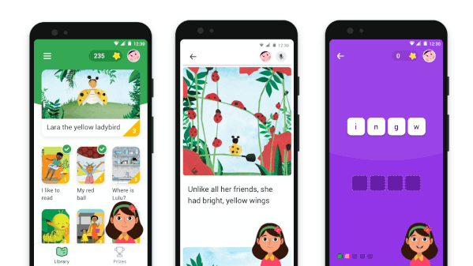

## AI와 언어 (구글, AI 활용해 어린이 언어 학습 어플 출시)
    구글이 인공지능(AI) 기술을 활용해 어린이가 언어를 배우도록 돕는 안드로이드 앱
    Read Along을 출시했습니다.
    
    Read Along은 대화형 게임으로 약 500개의 이야기를 통해서 별과 배지를 획득하는 앱입니다.
    디야라는 캐릭터가 단어와 문장을 발음하고, 어린이가 따라하면 자연어처리(NLP) 기술로
    감지해 지도합니다.
    
    사용자 수준을 감지하여 스토리와 게임의 난이도를 추천합니다. 로그인을 하지 않고도 사용 
    가능하며 서버를 이용하지 않은 채 음성을 분석해 처리합니다.
    
    영어, 스페인어, 포루투갈어등 9개의 언어를 지원합니다.
 
## AI와 음성 (SK텔레콤, AI로 코로나19 환자 증상 체크)
    SK텔레콤의 AI '누구(NUGU)가 코로나 19 자가격리, 능동감시 대상자에게 전화를 걸어 발열, 
    기침 등 증상 발현 여부를 체크하는 '누구 케어콜' 구축했습니다.
    
    SK텔레콤은 이동통신사 최소로 AI 어시스턴트를 이동통신망(IMS) 상에 구축했습니다. 
    별도의 앱이나 기기 없이 대상자는 전화 통화를 통해, 보건소 담당자는 전용 웹사이트를
    통해 누구 케어콜을 사용할 수 있습니다.
    
    누구 케어콜은 자연어처리(NLU), 음성 및 문자 간 상호 변환(STT/TTS) 기술을 활용해 
    ARS식 문답이 아닌 사람 간 대화에 가까운 질의응답 체계를 구현했습니다. 또 각 보건소에 
    맞춤형 기능도 갖춰 지역 사정에 맞게 활용이 가능합니다. 방역 현장 투입 후 피드백에
    따라 AI수신 시나리오도 추가할 수 있습니다.
