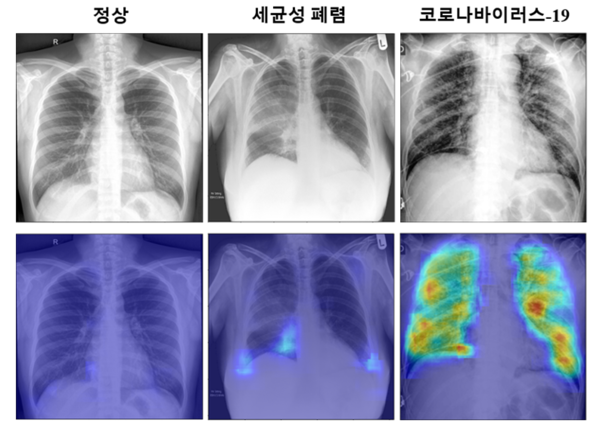

## AI와 언어 (구글, AI 활용해 어린이 언어 학습 어플 출시)
    구글이 인공지능(AI) 기술을 활용해 어린이가 언어를 배우도록 돕는 안드로이드 앱
    Read Along을 출시했습니다.
    
    Read Along은 대화형 게임으로 약 500개의 이야기를 통해서 별과 배지를 획득하는 앱입니다.
    디야라는 캐릭터가 단어와 문장을 발음하고, 어린이가 따라하면 자연어처리(NLP) 기술로
    감지해 지도합니다.
    
    사용자 수준을 감지하여 스토리와 게임의 난이도를 추천합니다. 로그인을 하지 않고도 사용 
    가능하며 서버를 이용하지 않은 채 음성을 분석해 처리합니다.
    
    영어, 스페인어, 포루투갈어등 9개의 언어를 지원합니다.
 
## AI와 음성 (SK텔레콤, AI로 코로나19 환자 증상 체크)
    SK텔레콤의 AI '누구(NUGU)가 코로나 19 자가격리, 능동감시 대상자에게 전화를 걸어 발열, 
    기침 등 증상 발현 여부를 체크하는 '누구 케어콜' 구축했습니다.
    
    SK텔레콤은 이동통신사 최소로 AI 어시스턴트를 이동통신망(IMS) 상에 구축했습니다. 
    별도의 앱이나 기기 없이 대상자는 전화 통화를 통해, 보건소 담당자는 전용 웹사이트를
    통해 누구 케어콜을 사용할 수 있습니다.
    
    누구 케어콜은 자연어처리(NLU), 음성 및 문자 간 상호 변환(STT/TTS) 기술을 활용해 
    ARS식 문답이 아닌 사람 간 대화에 가까운 질의응답 체계를 구현했습니다. 또 각 보건소에 
    맞춤형 기능도 갖춰 지역 사정에 맞게 활용이 가능합니다. 방역 현장 투입 후 피드백에
    따라 AI수신 시나리오도 추가할 수 있습니다.
 
 ## AI와 이미지 (KAIST 예종철 교수 연구팀, 86% 정확도 CXR 영상 진단 기술 개발
    한국과학기술원(KAISTㆍ총장 신성철)은 예종철 바이오및뇌공학과 교수 연구팀이 흉부 단순
    방사선 촬영(CXR) 영상을 활용해 코로나19 진단 정확성을 높인 AI 기술을 개발했습니다.
    
    영상 판독 전문가 분석 결과보다 약 17% 더 높은 86%의 정확성을 보였다고 설명했습니다.
    
    CXR은 각종 폐 질환 표준 선별 검사에 활용하는 치료법입니다. 코로나19 검사에서, 
    RT-PCRㆍCT 검사에 비해 정확성이 현저하게 떨어지지만 최근 코로나19 팬데믹으로 
    세계 각국에서 확진자 수가 급증하자 비용이 적게 들고 검사 방법이 용이한 CXR 
    검사를 활용하자는 요구가 증가하고 있습니다.
    
    예종철 교수는 "AI 알고리즘 기술을 선별 진료에 활용하면, 코로나19 감염 여부를 신속히 
    진단할 수 있고 한정적인 의료 자원을 보다 효율적으로 배분할 수 있을 것이다"라고 말했습니다.
 

## AI와 자율주행 (KT, 5G 자율주행 운반 카트 상용화)
    KT가 물류센터에 5G 자율주행 운반 카트를 도입했습니다. 자율주행 운반카트는 화물을 
    운반하고 운영 현황을 통합 관제합니다.

    KT는 자율주행 솔루션 업체 트위니와 공동개발한 5G 자율주행 운반 카트 '나르고'와 '따르고'를 
    KT서부물류센터에 도입했습니다.

    나르고는 자율주행으로 이동하는 선행 카트와 함께 주행하는 후행 카트로 구성, 한 번에 
    많은 양의 화물을 운반합니다. 따르고는 사람을 따라 자동으로 움직이며 넓은 범위에서 
    다양한 화물을 분류합니다.

    KT는 나르고와 따르고를 도입해 서부물류센터에서 작업자의 이동 거리가 47% 감소했다고 밝혔습니다.

    KT는 나르고와 따르고에 자율주행이동체(AIV) 서비스를 더했습니다. AIV 서비스는 산업현장의 
    실내 지도와 자율주행 운반 카트의 실시간 정보로 개별 이동, 호출 명령, 긴급상황 대응 등 
    운영 현황을 통합 관제하는 서비스입니다. 

    최강림 KT 커넥티드카 비즈센터장은 "AIV의 범위를 다양한 산업 현장로 넓혀 실생활에서 
    자율주행 기술의 혜택을 누릴 수 있도록 하겠다"고 말했습니다.
 
    
