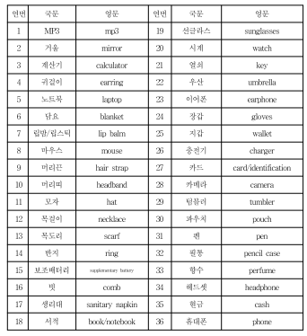
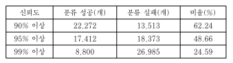
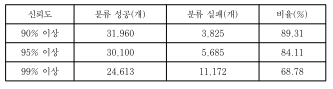
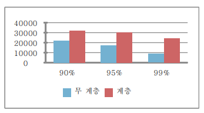

# 효율적인 사물 이미지 분류를 위한 계층적 이미지 분류 체계의 설계 및 구현

* 무 계층 이미지 분류에서는 상대적으로 유사한 모양을 가진 사물은 효율적으로 인식하지 못하는 모습을 보여줌

## 1. 서론 

1. 단계적 계층 구조에서의 이미지 분류 기법
2. 확장성에 대해서 고려하기 위해 확장성이 고려된 효율적인 클래스 구성 방식과 알고리즘 소개

```
  높은 신뢰도로 효율적인 이미지 분류 가능하게 함
```

* 기존에도 계층구조를 이용한 분류 방식이 있었지만 고정된 분류 체계를 사용했음
  * 유연성 부족
  * 클래스의 근본적인 수정이 필요하다는 단점
  
## 2. 단계적 계층 이미지 분류 구조
* Tensorflow와 Inception-v3사용

### 클래스 분류 36개의 항목에 대해 이미지 분류


 
### 클래스 분류 방식
* 재질, 유형, 용도, 범주
* 모든 아이템에 통상적으로 적용가능해야함
```
ex). 예를 들어, 담요는 면이나 천처럼 직물로
이루어져 있기 때문에 담요를 분류할 때 직물이라는
세부 특징을 기입할 수 있다. 반면, 텀블러와 같이 한
가지 재질이 아닌 여러 재질로 만들어지는 경우 하나
의 세부 특징을 선정할 수 없다. 이 같은 경우는 공백
으로 표시한다.
```

### 특징을 이용한 클래스 분류
* “재질, 유형, 용도, 범주”와 같은 특징들에 대해 우선순위를 선정

```
ex)‘재질’의 우선순위가
‘유형’보다 높으므로 서적과 현금이 하나의 클래스로
구성되고, 카드는 기타 클래스로 구성된다. 하지만 ‘유
형’을 기준으로 분류하면 세 물품은 ‘평평함’이라는 한
클래스로 구성된다. 따라서 우선순위가 낮아도 기타
클래스에 속하는 항목들의 개수를 줄이는 방향으로
클래스를 구성한다.
```

* 확장성 고려
```
ex)단소를 새롭게 추가하고자 할 때 ‘재질’은 나무 혹은
플라스틱이기 때문에 빈칸으로 두고 ‘유형’은 막대,
‘용도’는 음악 연주, ‘범주’는 악기라고 기입하면 새로
운 클래스 생성 없이 기존 막대 클래스에 추가하게 된
다
```

### 클래스 생성을 위한 알고리즘

* 깊이 우선 탐색(DFS: Depth-First Search)으로 조합 가능한 모든 경우를 확인
* 불필요한 반복을 하지 않도록 하여 시간을 단축

## 3. 실험 및 결과

### 실험 환경 및 실험 데이터

* 총 143,136개(15.4GB)데이터로 실험

###  실험 방법
* 75%의 이미지는 학습에 사용하고, 25%의 이미지는 테스트에 사용

### 실험 결과

* 무 계층 : 기준 정확도가 높아질수록 정확하게 분류하는 이미지의 개수가 대폭 감소하는 모습

* 단계적 계층 : 정상적으로 분류한 확률은 96.69%, 신뢰도가 증가하여도 인식률의 감소폭이 크지 않음


### 평가
무 계층 구조에서 이미지를 분류하는 것보다 단계적 계층 구조를 이용하는 것이 더 높은 신뢰도로 이미지를 분류할 수 있음

# 결론
* 단계적 계층구조에서의 이미지분류 체계는 사물 이미지를 높은 인식률로 분류할 수 있는 효율적인 방안
* 확장성을 고려한 클래스 설계 방식을 통해 새로운 물체가 추가되었을 때도 전체 객체를 처음부터 재학습하지 않아도 된다는 점에서 효율성이 높다
